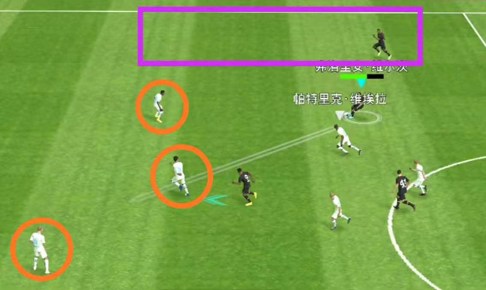
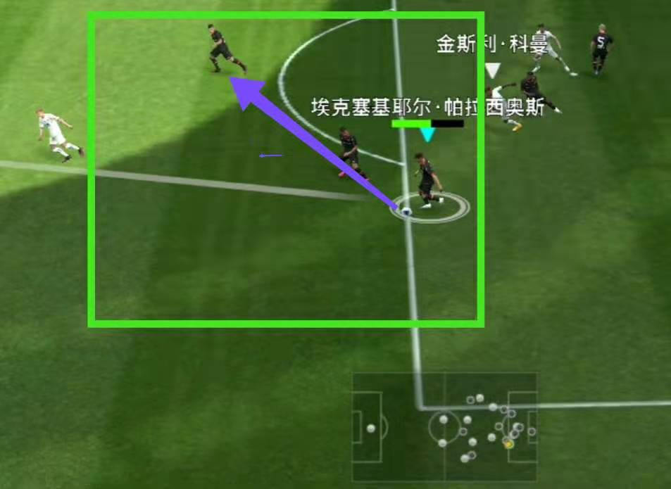

# 2021Q1

Match 4
-----------------------------------------------------------------------------

场次|比赛时间|比分|对手胜率|对手实力|对手阵型
----|--------|----|--------|--------|--------
004|2021-01-25|1:0|35%|4394|4-2-1-3

### 关键事件

#### 55' 前场二过一传球路线失误错失机会

右边锋、前腰和中锋三人在前场发起进攻，维尔茨传给中路的哈弗茨，哈弗茨向前传给中锋贝利，贝利和维尔茨进行二过一配合，贝利传球后立刻向进去跑动，维尔茨拿球后下意识地重新传给贝利。这里自己犯了一个错误：**为了二过一而二过一**，维尔茨拿球后重新塞给贝利是撞墙配合的标准套路，但是在实战中要根据场上的实际情况具体分析。此时对方三名防守球员都处于贝利跑动路线附近，尤其是对方的范迪克，更是预判了塞球路线。此时无脑传给贝利自然是被范迪克没收。而此时右后卫塔已经上来参与进攻，塔的前方有一大片空挡，所以维尔茨此时传给塔更加合理。这个球最终被范迪克拦下（[相关视频][L1]）。

#### 58' 对方打出流畅配合，莱万射失必进球

右边锋科曼塞球隔过莱万直接传给左边锋内马尔，再由内马尔传给中锋莱万。所幸莱万的推射力量小。

> 4213 进攻路线
> 
> 左边锋 → 前腰 →  中锋 →  右边锋 →  左边锋  →  中锋

#### 64' 后卫在本方禁区解围切忌盲目长传

对方德布劳内在中路传球找莱万，莱万将球分给科曼过程中，球先后被塔普索巴和协防的帕拉西奥斯拦截。抢下球权的后卫以最快的速度把球长传出去，这里就犯了一个错误——**没有冷静观察**。

从图中可以看到，在传球时，后卫周围根本没有对方球员施压，完全可以传给附近的队友，而自己由于慌乱盲目地直接水平向左划，在没有看到队友的位置或小地图的情况下，这种传球被断的概率极大。果然，处于传球路线上的对方德布劳内将球截下，一次反击的机会就这样被浪费。【[相关视频][M4C]】

#### 69' (1:0) 本德断球发起快速反击、哈弗茨秒传、贝利果断射门得分 

对方莱万在禁区前沿背身接到德布劳内的到底传球，拿球试图转身时被本德抢断，球到了哈弗茨脚下，哈弗茨斜传找维尔茨。此时对方范迪克已逼近施压，维尔茨无法向前推进，一记漂亮的塞球重新找到中路的哈弗茨。哈弗茨看到前面的贝利开始加速，一记直塞将球送出。防守贝利的德里赫特关键时刻断触出现停顿。贝利利用停顿的这一下闪开空位，加速向禁区内冲刺，左脚果断射门得分！【[相关视频][M4P4]】

#### 76' 维尔茨送出弧线直塞、迪亚比错失机会

中锋和左右边锋向前推进。贝利斜传维尔茨，在中路贝利未插上的情况下，维尔茨一记长距离斜塞球找左路的迪亚比。这个塞球充分展示了维尔茨的直传球功夫。皮球线路呈弧线运行，完美地绕过了中路防守的拉莫斯。迪亚比第一次停球有点慢，第二次拿球时不果断，被拉莫斯倒地断下。【[相关视频][M4P5]】

Match 3
-----------------------------------------------------------------------------

场次|比赛时间|比分|对手胜率|对手实力|对手阵型
----|--------|----|--------|--------|--------
003|2021-01-24|3:4|42%|4376|4-2-1-3

关键事件：

- **2' (0-1): 哈弗茨防守失误，吉格斯助攻莫伦特斯得分**
  
  对方的阵型和自己相同。比赛刚开始，莫伦特斯回传后腰阿隆索，后者带球后再次传给莫伦特斯，莫伦特斯斜传左边锋吉格斯。附近的哈弗茨在防守时可能是误触到方向键，导致防守失败。吉格斯直塞给莫伦特斯直接得分；

- **10' (1-1): 维尔茨角球乱战中得分**
  
  德米尔巴伊右侧开出角球，迪亚比争到第一点，皮球落到了对方后卫脚下，后卫解围失误，球被维尔茨抢到，维尔茨门前推射得分；

- **20' (1-2): 马尔蒂尼发起反击，莫伦特斯再下一城**
  
  右路马尔蒂尼长传直接找到姆巴佩，姆巴佩摆脱辛克赫拉芬将球传给中锋莫伦特斯。中路塔普索巴上前施压，莫伦特斯再次将球分给姆巴佩。本德根本追不上姆巴佩，后者下底传中。莫伦特斯头球得分；
- **32' (2-2): 迪亚比定位球混战中偷袭得分**
  
  第 31 分钟，德米尔巴伊定位球中过顶传球给迪亚比，迪亚比头球将球顶到对方前腰马拉多纳脚下，马拉多纳解围却将球传给了迪亚比，迪亚比稍作调整后左脚怒射得分；

- **46' (2-3): 快发任意球失误被对方打反击**
  
  阿拉里奥快发任意球时太过仓促，传球给德米尔巴伊时被对方前腰马拉多纳抢断，马拉多纳在不转身的情况下将球传给中锋莫伦特斯，后者再斜传给姆巴佩。塔普索巴迅速向禁区回撤，协防的本德依旧跑不过姆巴佩。姆巴佩在塔普索巴的干扰下完成射门，球经过变线后吊向球门，守门员单手将球托出，不幸的是，门前的塔未第一时间拿到球，被插上的吉格斯推射得分；

- **55' (3-3): 连续一脚传球由哈弗茨扳平比分**
  
  中前场在右路连续一脚传球，最终由阿拉里奥助攻哈弗茨远射得分。注意这里的传球并不是单触传球，而是接球后有一个停球，调整后再传，这样保证了准确率。

- **63' (3-4): 后卫组织进攻时忙中出错，被吉格斯将比分反超**
  
  比赛第 63 分钟，门将短传给本德，想由左路发起进攻。这里自己的观察出现了问题，此时对方前场球员都集中在左路，从右路发起进攻更好。本德接到球后发现前面有三个对方球员无法向前推进，只能回传给左后卫辛克格拉芬，姆巴佩向前施压。辛克格拉芬慌乱中向前直塞，结果塞大了，被对手一波连续配合后，由吉格斯将球打进。

## Matchday 002

场次|比赛时间|比分|对手胜率|对手实力|对手阵型
----|--------|----|--------|--------|--------
002|2021-01-21|3:0|39%|3729|4-3-3

关键事件：

**53' (1-0): 哈弗茨传跑促得分**
  
塔普索巴禁区前组织进攻，没有传给距离他相对较近的中场，而是直接传给位于中圈附近的哈弗茨。哈弗茨不转身回敲左路的德米尔巴伊，同时开始传跑。德米尔巴伊传给左边锋迪亚比，后者再传给中锋阿拉里奥。在这个过程中，哈弗茨一直往禁区方向跑。阿拉里奥拿球后看到哈弗茨已经跑出了空挡，顺势向前直塞。哈弗茨在大禁区线上面对对面的后卫果断抽射破门；

这是一次非常成功的进攻套路，可以在后续的比赛中再次使用。

**56' (2-0): 哈弗茨挑传助攻阿拉里奥得分**

对方后腰向右路长传时，直接传到迪亚比脚下。迪亚比没有立刻向前传给中锋，而是传给中路的哈弗茨。哈弗茨一个过顶直塞传给阿拉里奥，后者停球后进入禁区稍作调整破门得分。

**71' (3-0): 迪亚比下底直塞，阿拉里奥门前爆射**

本德后者断球发起进攻，斜传给左边锋迪亚比。迪亚比身边有两名对方球员包夹无法向前推进，只能回传左后卫辛克赫拉芬，同时传跑向边路跑动。辛克赫拉芬传给德米尔巴伊，后者在传给哈弗茨。此时迪亚比已经跑到对方禁区线附近。哈弗茨塞球找迪亚比，迪亚比直接塞球找中路的阿拉里奥。阿拉里奥门前抢在对方后卫乌姆蒂蒂前暴力射门得分。这个进球也直接导致对手强退。

## Match 001

- 13' (0-1): 孔德传球失误被皮耶罗断下，球到了C罗脚下。C罗带球后射门，门将脱手，跟上的桑乔补射得分；
- 32' (0-2): 桑松传球失误被小贝断下，小贝塞球给桑乔，桑乔直塞给C罗，防守C罗的孔德根本跑不过C罗，C罗抽射得分；
- 52' (0-3): 科曼右路塞球被阿拉巴挡住，球弹到维埃拉脚下，维埃拉传给小罗。面对朗格莱的施压，小罗漂亮地转向，将球分给桑乔，最终由桑乔得分。
  
  此次自己进攻时过于着急，每次都想一次传球打出配合，但是每次传球路线都不好，最终被反击；

[L1]: https://www.bilibili.com/video/BV1Wz4y1S7pS?p=1 "不要为了二过一而二过一，撞墙后要把球传向空旷地带"
[M4C]: https://www.bilibili.com/video/BV1fT4y1A7Zv?p=3 "后卫进去解围不观察盲目直传被断"
[M4P4]: https://www.bilibili.com/video/BV1fT4y1A7Zv?p=4 "哈弗茨秒传"
[M4P5]: https://www.bilibili.com/video/BV1fT4y1A7Zv?p=5 "哈弗茨秒传"
